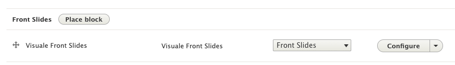

# Visuale Drupal Front Slides Module

## About
This is a small module that I made to display a sliding carousel of slide "trays" of project thumbnails, which in turn can present pop-up modals with more details by way of JS events. Most of the display functionality and all of the formatting is contained in the associated theme, which is located here: <https://github.com/visuale/visuale-drupal-theme>


## Data Nodes
This module is a fairly simple data pull. The block file is here:

**/visuale_front_slides/src/Plugin/Block/VisualeFrontSlidesBlock.php**

It queries published development project node types  from `development_projects` and returns a few fields:

* Field `field_main_project_image` from which it loads `slideshow_thumbnail` for an image type.
* A url path via `path.alias_manager`
* The node id with `$node->id()`
* The node title: `$node->getTitle()`
* The field value for `field_client_location`
* The project url: `$node->toUrl()->toString()`
* Some project notes: `field_client_notes`

## Use with theme
Because this module is meant to work as part of a specific theme, the module's block is added within the theme itself. In the associated theme  (called `visuale`), a new region is created within **visuale/visuale.info.yml**
```
[...]
regions:
	frontslides: 'Front Slides'
```
The region was added for formatting purposes but this tray display could be plugged into any section of the website. With this set, however, there will be a region available to it specifically in the admin section at **Home > Administration > Structure**

